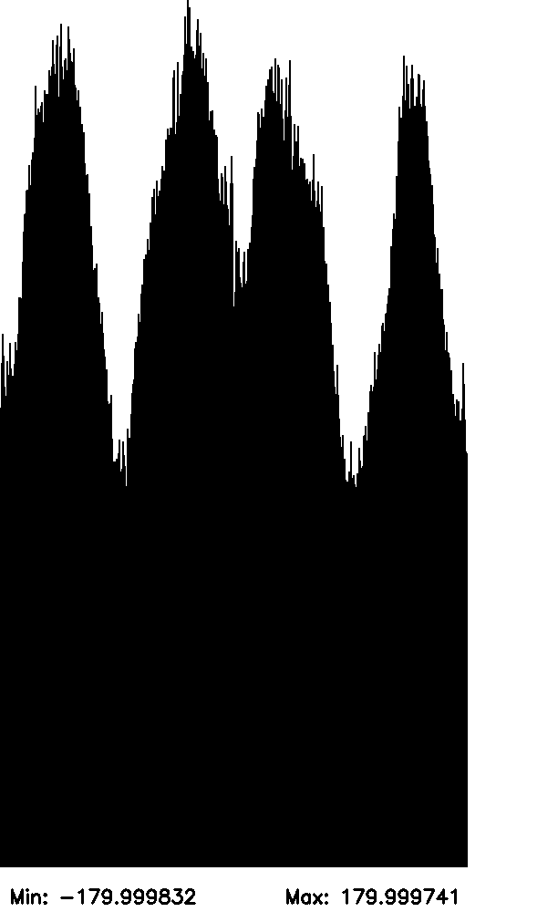
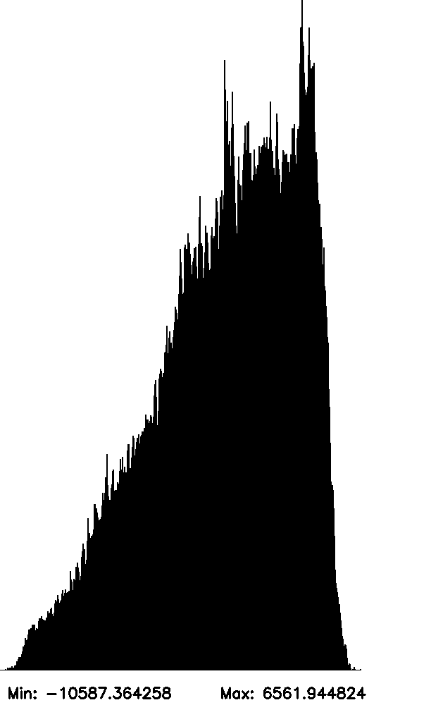

# Sheet Stitching Problem Playground

## Intro

This repository contains a C++ playground to quickly implement different solutions to the "sheet stitching" graph problem.
Please read the PDF [Sheet_Stitching_Problem_Definition.pdf](./Sheet_Stitching_Problem_Definition.pdf) for an overview and introduction to the problem.

## How to Use the Playground
### Directory Structure:

```plaintext
graph_problem/
├── CMakeLists.txt
└── example.cpp
```

Build the Project:
```bash
mkdir build
cd build
cmake ..
make
```

This will generate the graph_problem executable in the build directory.
Run the Executable:

```bash
./build/example
```

You have now loaded the graph into memory, created, and saved an initial histogram of the graph.



As can be seen, the distribution of "winding angle" is peaky and widely distributed over the segmentation patches.

Our goal is to formally define and then solve objectives over this graph that correct the erroneous patch linkages and assign more accurate winding numbers to the patches.
For example, after solving, the winding angle distribution over the graph might look like this:



This more aligns with the expected distribution, where a small number of patches have a small winding angle, near the scroll center where the wrap circumference is small.
As we get further away from the scroll center and the circumference grows, more papyrus area is required to span the same angular difference, so the patch frequency grows with respect to winding number.

Enjoy the playground!