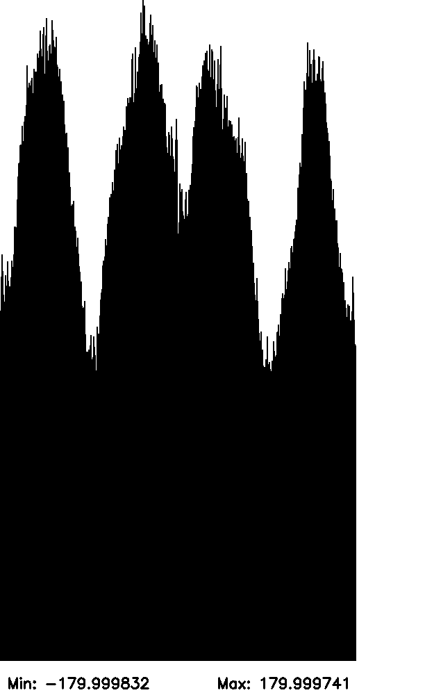

# Sheet Stitching Problem Playground

## Intro

This repository contains a C++ playground to quickly implement different solutions to the "sheet stitching" graph problem.
Please read the PDF [Sheet_Stitching_Problem_Definition.pdf](./Sheet_Stitching_Problem_Definition.pdf) for an overview and introduction to the problem.

## How to Use the Playground
### Directory Structure:

```plaintext
graph_problem/
├── CMakeLists.txt
└── example.cpp
```

Build the Project:
```bash
mkdir build
cd build
cmake ..
make
```

This will generate the graph_problem executable in the build directory.
Run the Executable:

```bash
./build/example
```

You have now loaded the graph into memory, created, and saved an initial histogram of the graph.



Enjoy the playground!